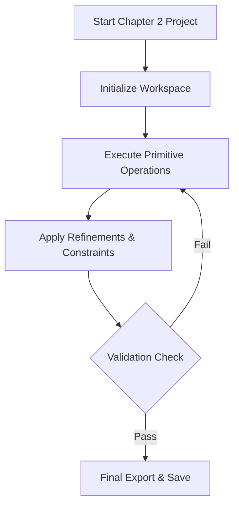

# Chapter 2: Advanced 3D Design Masterclass (TIER3)


## 📌 Executive Summary & Learning Objectives
Welcome to **Chapter 2** of the 3D Design track. In this comprehensive session, students will transition from foundational concepts into practical execution.

### Key Learning Outcomes:
*   Master the core principles of 3D Design appropriate for **TIER3** level.
*   Apply computational thinking to solve real-world design and logic problems.
*   Deploy and test digital artifacts independently.

---

## ⏱️ 80-Minute Class Timeline
| Duration | Activity | Description |
| :--- | :--- | :--- |
| **20 mins** | 📚 Theory & Concepts | Deep dive into the core principles, architecture, and real-world applications. |
| **45 mins** | 🛠️ Practical Lab | Hands-on execution, wiring, coding, or building the project. |
| **10 mins** | 🔧 Troubleshooting | Debugging code, fixing circuit issues, and checking connections. |
| **5 mins** | 🧠 Quiz & Assessment | Quick knowledge check and self-assessment questions. |

---

## 🛠️ Required Software & Digital Tools Checklist
*   [ ] High-Speed Internet Connection
*   [ ] Modern Web Browser (Google Chrome / Brave / Edge)
*   [ ] Active Student Account on Platform (Tinkercad / Python IDE / AI Studio)
*   [ ] Digital Stylus / Mouse for 3D Navigation

---

## 🔬 Deep-Dive Theoretical Foundations (20 mins)

### 1. Fundamental Principles
Every modern 3D Design system relies on structural rules. Understanding dimensions, logic flow, or prompt structures dictates the quality of the output.

```
+--------------------------------------------------------+
|               CORE ARCHITECTURE WORKFLOW               |
|  [Input / Prompt] --> [Processing / Logic] --> [Output]|
+--------------------------------------------------------+
```

### 2. Industry Standard Terminology
*   **Vector Grid:** Coordinate space governing placement and movement.
*   **Iteration:** The process of testing, refining, and re-executing code or designs until perfection.
*   **Abstraction:** Hiding background complexity to focus on high-level design elements.

---

## 💻 Step-by-Step Practical Implementation Guide (45 mins)

### Step 1: Environment Initialization
1.  Launch your designated workstation software.
2.  Verify active session tokens and ensure workspace scaling is set to 1:1 metric ratio.

### Step 2: Core Workflow Execution
1.  **Construct Phase:** Build the primary structure using primitive building blocks or fundamental tags.
2.  **Refine Phase:** Apply advanced parameters, variable assignments, or grouping features.
3.  **Optimize Phase:** Eliminate redundant code or overlapping geometry to maximize efficiency.



---

## 🌍 Real-World Industrial Applications
*   **Automotive Industry:** Rapid prototyping using CAD tools saves millions in manufacturing costs.
*   **Software Engineering:** Clean coding standards and structured logic power modern mobile apps.
*   **Artificial Intelligence:** Prompt engineering and media generation streamline modern digital marketing and automated content creation.

---

## 🧠 Knowledge Check & Self-Assessment (5 mins)

**Q1: What is the primary purpose of iteration during the project workflow?**
*Answer: Iteration allows developers and designers to incrementally test, identify bugs, and improve performance.*

**Q2: Why is proper workspace scaling crucial before exporting models or code?**
*Answer: Scaling ensures compatibility with physical printers or browser rendering engines without distortion.*

**Q3: Name one key benefit of abstraction in software design.**
*Answer: It reduces complexity and allows creators to work efficiently without getting bogged down by low-level details.*
