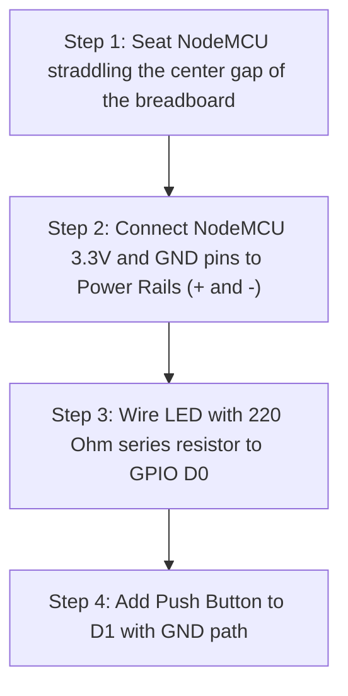

# Session 01: ESP8266 Pin Map & Limits

**Class 6 – ROBOTICS TRACK**  
Tier Curriculum | Connect Shiksha


> **Session 01** | 80 Minutes | ROBOTICS Track
>
> **Beginners ke liye — GPIO, Power, ADC, aur Communication Pins ka complete guide**

---

## Class Schedule (80 Minutes)

| Time | Activity | Focus |
|:---|:---|:---|
| **0-20 min** | Theory | NodeMCU ESP8266 specs, hardware overview, and pin map |
| **20-65 min** | Practical Lab | Component wiring & ESP8266 safety bounds |
| **65-75 min** | Debug & Fix | Boot restriction troubleshooting & limits check |
| **75-80 min** | Quick Quiz | Hands-on practice assessment & task check |

**Keywords:** `ESP8266` | `NodeMCU` | `Pinout Map` | `Boot State` | `ADC A0`

---

## Theory (20 Minutes)

### 1. ESP8266 (NodeMCU) Kya Hai?
* **All-in-One Board:** Microcontroller + built-in Wi-Fi ek hi compact board mein — sab kuch ek jagah!
* **USB se Program Karo:** Directly USB cable se upload karo — koi extra adapter ya programmer nahi chahiye.
* **IoT ka Sabse Sasta Option:** IoT projects ke liye sabse popular aur budget-friendly development board.

### 2. ESP8266 Key Specifications (Hardware Overview)

| Feature | Detail |
|:---|:---|
| **Processor** | Tensilica L106, 80 MHz |
| **Wi-Fi** | 802.11 b/g/n (2.4 GHz) |
| **GPIO Pins** | 11 usable (D0–D10) |
| **Flash Memory** | 4 MB |
| **SRAM** | 80 KB |
| **Operating Voltage** | 3.3V (USB = 5V tolerant) |

### 3. NodeMCU Pin Map – D-Pins to GPIO
> [!IMPORTANT]
> Har D-pin ka ek corresponding GPIO number hota hai. Yeh mapping yaad rakhna bahut zaroori hai!

| D-Pin | GPIO | Function / Note | Boot Restriction |
|:---|:---|:---|:---|
| **D0** | GPIO16 | Deep sleep wake pin — No Interrupt / No PWM | — |
| **D1** | GPIO5 | I²C SCL (default) | — |
| **D2** | GPIO4 | I²C SDA (default) | — |
| **D3** | GPIO0 | Flash button | **HIGH hona chahiye** |
| **D4** | GPIO2 | Onboard Blue LED (active LOW) | **HIGH hona chahiye** |
| **D5** | GPIO14 | SPI SCK | — |
| **D6** | GPIO12 | SPI MISO | — |
| **D7** | GPIO13 | SPI MOSI | — |
| **D8** | GPIO15 | SPI CS | **LOW hona chahiye** |

### 4. ⚠️ Pin Limits — Ye Galtiyan Mat Karo!
* **D0 (GPIO16) Bahut Limited Hai:** Interrupt, PWM, I2C, ya Open-drain — kuch bhi nahi chalta. Sirf basic digital read/write ke liye use karein.
* **D3, D4, D8 Boot State Critical:** Boot ke time inhe galat state mein rakha to board start hi nahi hoga! Always double-check pull-up/pull-down connections.
* **3.3V Logic Only — 5V Mat Lagao!** GPIO pins pe directly 5V lagane se board permanently kharab ho sakta hai ⚡.
* **A0 (ADC) — Max 1.0V Input:** NodeMCU chip internally 0-1.0V support karti hai. A0 pin pe directly 3.3V se zyada voltage mat lagayein, voltage divider sirf board ke andar standard inputs ke liye hai.

### 5. ADC Pin – A0 ka Sahi Use
* **Resolution:** 10-bit → `0` se `1023` tak values milti hain.
* **Input Range:** Board pe voltage divider hai jo 0–3.3V ko internally 0–1V mein convert karta hai.
* **Common Use Cases:** Potentiometer (volume knob jaisi), LDR (light sensor), Soil Moisture Sensor.

### 6. Communication Pins – UART, I2C, SPI
NodeMCU teen tarah ke communication protocols support karta hai:
* **UART (Serial):** `D9 → RX (GPIO3)`, `D10 → TX (GPIO1)`. PC se data send/receive aur debugging ke liye.
* **I2C:** `D1 → SCL (GPIO5)`, `D2 → SDA (GPIO4)`. OLED displays, BMP280 pressure sensors ke liye.
* **SPI:** `D5 → SCK`, `D6 → MISO`, `D7 → MOSI`, `D8 → CS`. Displays aur SD card readers ke liye.

---

## Practical Lab (45 Minutes)

### Step 1: Component Identification & Connections
Yahan kuch commonly used sensors aur unke connections diye gaye hain:

* **LED (with resistor):** LED positive leg → `D0 (GPIO16)`, negative leg → `GND` (220Ω resistor in series).
* **Push Button:** Button terminal 1 → `D1 (GPIO5)`, terminal 2 → `GND` (use internal pull-up resistor).
* **Buzzer:** Buzzer Positive → `D2 (GPIO4)`, Negative → `GND`.
* **Relay Module:** IN → `D3 (GPIO0)`, VCC → `3.3V`, GND → `GND`.
* **DHT11 Temp/Humidity:** Data → `D4 (GPIO2)`, VCC → `3.3V`, GND → `GND`.
* **Ultrasonic HC-SR04:** Trig → `D5 (GPIO14)`, Echo → `D6 (GPIO12)`, VCC → `3.3V/5V`, GND → `GND`.

### Step 2: Breadboard Wiring Guide — Step-by-Step


### Step 3: Write Code
Here is the basic code to read the LDR sensor on A0 and print it to the Serial Monitor:

```cpp
void setup() {
    Serial.begin(115200); // Start serial communication at 115200 baud
}

void loop() {
    int sensorValue = analogRead(A0); // Read the analog value on A0
    Serial.print("LDR Analog Value: ");
    Serial.println(sensorValue);      // Print value to serial monitor
    delay(500);                       // Wait for 500ms
}
```

---

## Troubleshooting Guide

| Problem | Solution |
|:---|:---|
| **NodeMCU won't boot / Blue LED constant ON** | Check D3/D4 state (must be HIGH) and D8 state (must be LOW at boot). Disconnect connections to these pins and try re-booting. |
| **Garbled / Junk text on Serial Monitor** | Change the Serial Monitor baud rate in Arduino IDE to match `115200` (baud rate defined in `Serial.begin`). |
| **A0 sensor value always 1023** | Check if the sensor input is exceeding 3.3V, or check if the VCC pin of the sensor is correctly connected to 3.3V. |

---

## Student Task — Hands-On Practice

1. **Pin Diagram Draw Karo:** NodeMCU ka pin diagram draw karo aur har D-pin ke saath uska GPIO number aur function likho.
2. **D0 vs D4 Comparison Table:** D0 aur D4 ke limitations ek table mein side-by-side compare karo — kya support hai, kya nahi.
3. **LDR + A0 Project:** A0 pin pe LDR sensor connect karo. Arduino IDE mein code likho aur Serial Monitor mein analog value print karo.
4. **❓ Bonus Question:** Batao — D3 ko boot ke time HIGH kyun rakhna padta hai? Agar LOW ho to kya hoga?

---

## Sources
* [NodeMCU ESP8266: Pinout, Specs, and Common Issues](https://connect-shiksha-guide.netlify.app/2-months-robotics-iot/)
* [ESP8266 NodeMCU V2 - Circuitrocks Documentations](https://connect-shiksha-guide.netlify.app/2-months-robotics-iot/)
* [gpio - NodeMCU Documentation](https://connect-shiksha-guide.netlify.app/2-months-robotics-iot/)
