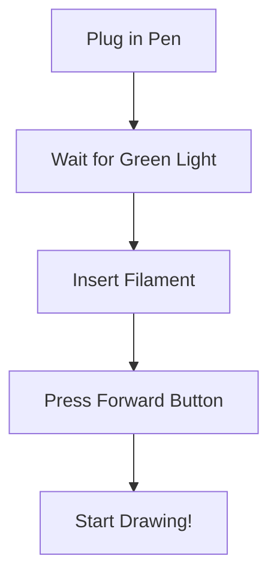

# Day 1: Intro to Dimensions & 3D Pen Safety
## Overview
Welcome to the world of 3D! Today we will learn the difference between 2D (flat) shapes and 3D (solid) objects. We will also learn how to safely handle our main tool: the 3D Pen.

## Theory & Definitions
*   **2D (Two-Dimensional):** A flat shape that only has length and width (e.g., a square drawn on paper).
*   **3D (Three-Dimensional):** A solid object that has length, width, and height (e.g., a cube or a box).
*   **PLA Filament:** A special type of plastic made from corn starch that melts when heated and hardens when it cools. This is the "ink" for our 3D pen.
*   **Nozzle:** The very tip of the 3D pen where the hot plastic comes out. **WARNING: It gets very hot!**

## Step-by-Step Practical Setup
### Step 1: Safety First
Always keep your fingers away from the metal nozzle. Do not touch the melted plastic immediately after it comes out; wait 5 seconds for it to cool.

### Step 2: Preparing the 3D Pen
1.  Plug the 3D pen into the power source.
2.  Press the 'Heat' button and wait for the light to turn Green.
3.  Insert the PLA Filament into the back hole of the pen.
4.  Press and hold the 'Forward' button until plastic starts coming out of the nozzle.

### Step 3: Drawing your first line
Hold the pen like a normal pencil, but press the button to extrude plastic. Try drawing a straight line on a piece of paper!

## Visual Reference

