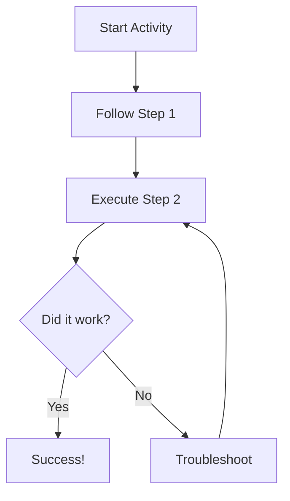

# Day 16: Detailed Lesson for Coding
## Overview
In this lesson, students will dive deep into advanced concepts of Coding.

## Theory & Definitions
*   **Key Concept A:** This is a crucial foundation for understanding Coding.
*   **Key Concept B:** It allows us to build upon what we learned yesterday.

## Step-by-Step Practical Setup
### Step 1: Preparation
Gather all necessary materials from the Tier 1 kit or open the required software environment.

### Step 2: Execution
1.  Follow the safety guidelines strictly.
2.  Connect the components or write the initial setup code as demonstrated by the instructor.
3.  Test your setup to ensure it functions correctly.

### Step 3: Troubleshooting
If it does not work, double-check your wiring or syntax. 

## Flow Diagram

