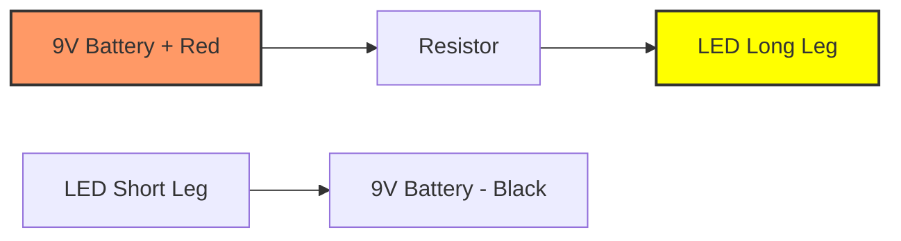

# Day 19: Battery Magic & Circuit Path
## Overview
Welcome to the Hardware Lab! Today we learn about Electricity and Circuits. We will use our Tier 1 Kit to light up an LED.

## Theory & Definitions
*   **Circuit:** A circular path that electricity flows through.
*   **Battery:** The power source. It has a positive (+) and negative (-) terminal.
*   **LED (Light Emitting Diode):** A tiny light bulb. It only lets electricity flow in one direction!
    *   *Long Leg:* Positive (Anode)
    *   *Short Leg:* Negative (Cathode)

## Step-by-Step Practical Setup
### Step 1: Component Check
Find these in your kit: 1x 9V Battery, 1x Battery Snap connector (with Red and Black wires), 1x Resistor, 1x LED.

### Step 2: The Wiring
1.  Attach the snap connector to the 9V battery.
2.  The **Red wire** is Positive (+). Twist the red wire onto one end of the Resistor.
3.  Twist the other end of the resistor to the **Long Leg** of the LED.
4.  The **Black wire** is Negative (-). Twist the black wire to the **Short Leg** of the LED.
5.  *Let there be light!*

## Circuit Connection Diagram

