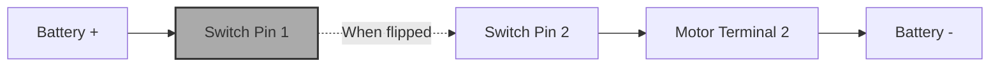

# Day 21: Switch Control
## Overview
Yesterday our motor ran endlessly. Today we learn how to control electricity using Switches!

## Theory & Definitions
*   **Switch:** A mechanical device used to break or complete an electrical circuit. 
    *   **Open Circuit:** The switch is OFF. Electricity cannot flow.
    *   **Closed Circuit:** The switch is ON. Electricity flows!
*   **Rocker Switch:** A switch that rocks back and forth (like a light switch).
*   **Push Button:** A switch that only works when you actively hold it down.

## Step-by-Step Practical Setup
### Step 1: Wiring a Switch
1.  Connect the Battery Red (+) wire to one metal pin on the Rocker Switch.
2.  Take a new piece of wire. Connect it from the second pin of the switch to the Motor.
3.  Connect the Motor's other side back to the Battery Black (-) wire.

### Step 2: Testing
Flip the rocker switch. The motor should spin. Flip it back, and it should stop. You are now controlling the flow of electricity!

## Circuit Connection Diagram

